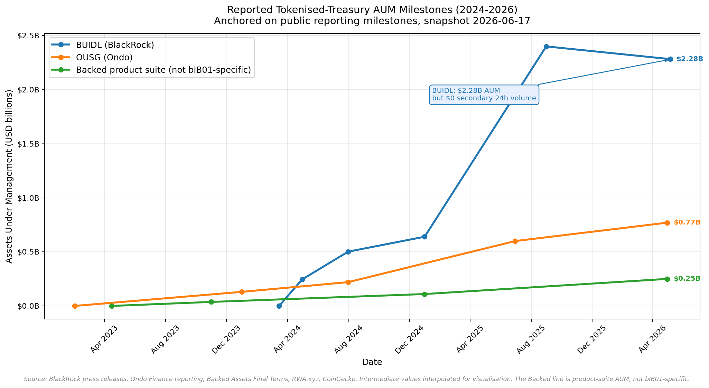
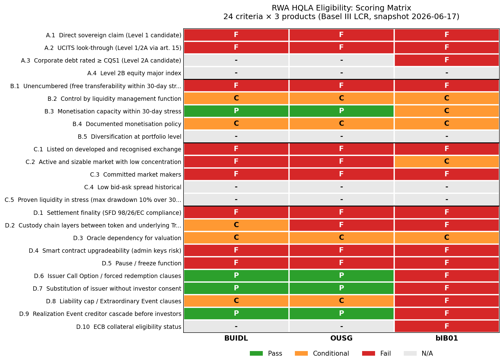
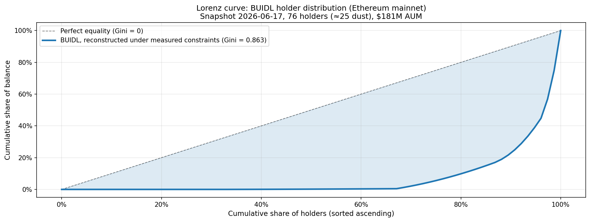
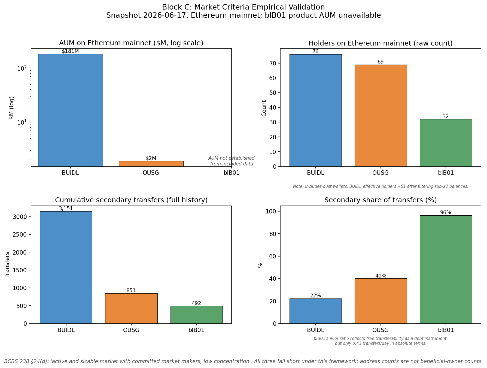
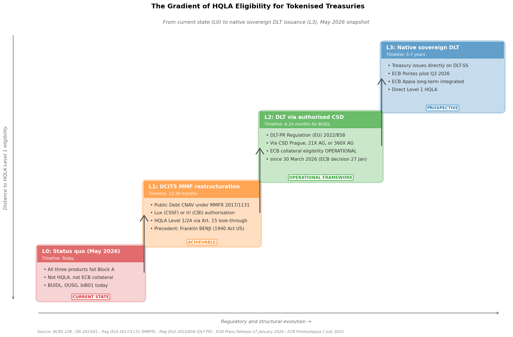

# Why Three Major Tokenised Treasury Products Are Not HQLA: and What It Would Take

*A regulatory and empirical framework for assessing the High-Quality Liquid Asset eligibility of tokenised Real-World Assets under Basel III*

---

## 0. The contradiction at the heart of tokenised treasuries

BlackRock's BUIDL fund holds $2.28 billion in tokenised US Treasury exposure across eight blockchains. Its secondary market trading volume over the last 24 hours, as reported by CoinGecko on 6 May 2026, is exactly zero dollars. Ondo Finance's OUSG completed a cross-border settlement pilot with JPMorgan Kinexys, Mastercard MTN, and Ripple on 6 May 2026, with USD 230,000 of value moved on-chain end-to-end. Backed Finance's bIB01 carries a Liechtenstein FMA-approved base prospectus passporting into thirty European jurisdictions.

All three products are described, marketed, and analysed as tokenised treasuries. None of them qualifies as High-Quality Liquid Asset (HQLA) under the Basel III Liquidity Coverage Ratio framework: neither as Level 1, nor Level 2A, nor Level 2B.

This article explains why. It walks through a 24-criteria eligibility framework derived from BCBS 238 (2013), the EU Capital Requirements Regulation (CRR), and Commission Delegated Regulation (EU) 2015/61. It pairs the regulatory analysis with on-chain empirical data showing that the market microstructure of tokenised treasuries is materially more concentrated than that of traditional HQLA reference assets. And it sets out a gradient of structural changes (L1 to L3) that would be required to reach progressively higher levels of eligibility.

The verdict is straightforward. The path forward is not.

---

## 1. Why this matters now

The tokenised treasury market has grown from approximately zero in early 2023 to roughly $12.9 billion in cumulative onchain value by April 2026, with US Treasury products accounting for the largest single category. This is no longer a marginal experimental segment of the digital asset universe, it is a structurally relevant slice of institutional cash management infrastructure.

The regulatory environment is in active review mode. The European Banking Authority published its report on tokenised deposits in December 2024. The European Securities and Markets Authority submitted its report on the functioning of the DLT Pilot Regime to the European Commission on 25 June 2025 and recommended amendments to improve uptake and clarify the regime's long-term status. The European Central Bank's Governing Council decided on 27 January 2026 that, from 30 March 2026, marketable assets issued in CSDs using DLT-based services can enter the Eurosystem collateral framework when they also satisfy the standard eligibility, settlement, and collateral-management requirements. The Federal Reserve, Office of the Comptroller of the Currency, and Federal Deposit Insurance Corporation issued an interagency FAQ on 5 March 2026 clarifying that the capital rule is technology-neutral and the use of distributed ledger technology to record ownership or facilitate transfers does not, by itself, alter the risk profile of the underlying security.

These are not minor procedural updates. They are structural moves that reshape how prudential frameworks will treat tokenised assets going forward. But none of them addresses the central question this article tackles: under the existing Basel III LCR framework, which has not been amended for tokenised instruments since the 2018/1620 update of DR 2015/61, are tokenised treasuries HQLA-eligible?

The analytical gap is wide. The primary regulatory texts predate the existence of these products. The product disclosures focus on operational mechanics, not prudential classification. Supervisory positions exist for fragments of the question (capital treatment, collateral eligibility) but not for the full HQLA assessment. This article fills that gap with a methodology that any institution can apply to existing or future tokenised products.

The contribution is intentionally modest: a first-version framework, open to peer challenge, applied to the three largest products as of June 2026. The framework is in the public domain. The matrix and the empirical analysis are reproducible. The verdict, however, is unambiguous.

---

## 2. The framework in five minutes

Basel III HQLA eligibility is a cascade. An asset must satisfy four cumulative conditions to qualify: it must belong to an eligible category, it must satisfy operational requirements, it must exhibit specific market characteristics, and, when wrapped in a non-standard legal structure, it must not introduce structural frictions that disqualify it on qualitative grounds. The framework presented here organises these conditions into four blocks, each containing multiple criteria with primary regulatory references.

**Block A: Eligibility category.** Under DR 2015/61 Articles 10 to 14, an asset qualifies as HQLA only if it falls into one of the recognised categories. Level 1 covers direct claims on or guaranteed by central governments, central banks, or qualifying supranational institutions. Level 2A covers certain corporate debt securities rated at least Credit Quality Step 1 and certain covered bonds. Level 2B covers specific equity securities, asset-backed securities, and a narrow set of other instruments. Article 15 provides a look-through mechanism for holdings of UCITS units, subject to a per-institution cap of €500 million. A token representing an indirect claim on US Treasuries via a fund wrapper does not, on its face, satisfy the Level 1 direct-claim test. Whether it can satisfy the UCITS look-through test depends on the underlying fund's regulatory status.

**Block B: Operational requirements.** Under DR 2015/61 Articles 7 and 8, an asset must be unencumbered, under the control of the liquidity management function, monetisable within a 30-day stress window, supported by a documented monetisation policy, and held in a diversified portfolio. These are technology-neutral requirements but their application to tokenised assets raises specific questions: whitelist-restricted transfers, smart contract pause functions, and settlement finality under public blockchain consensus all bear on the operational test.

**Block C: Market criteria.** Under BCBS 238 §24, an HQLA asset must trade in an active and sizable market, be listed on a developed and recognised exchange, be supported by committed market makers, exhibit low bid-ask spreads in normal conditions, and demonstrate proven liquidity in stress. The empirical layer of this article validates whether tokenised treasuries satisfy these conditions in practice.

**Block D: Wrapper-specific friction.** The Basel and EU texts predate tokenised wrappers. This block, the framework's own contribution, identifies frictions specific to current wrapper designs: settlement finality under SFD 98/26/EC, custody chain layers, oracle dependency, smart contract upgradeability, pause and freeze functions, unilateral issuer call options, substitution clauses without investor consent, extraordinary event clauses, creditor cascade structures, and explicit ECB collateral eligibility status.

Each criterion is rated per product on a four-level scale: Pass, Conditional, Fail, or N/A. Block A is cascading: any Fail closes the level for that product. Blocks B, C, and D are independent. The overall HQLA verdict requires Pass in Blocks A and C; Block B Fails are typically remediable through operational changes; Block D Fails are qualitative red flags for supervisory review.

The framework deliberately uses primary regulatory references in each cell. Every Fail is anchored to either a specific statutory provision (DR 2015/61 Art. 10(1)(a) for direct sovereign claim; CRR Art. 122 for unrated corporate treatment) or a specific contractual clause from the product's primary documentation (Final Terms, Form D filing, Private Placement Memorandum). The methodology is auditable. The conclusions are not opinions.

---

## 3. Product anatomy: BUIDL, OUSG, bIB01

The three products studied appear interchangeable at the marketing level: all three offer tokenised exposure to short-duration US Treasury risk. Their legal structures are radically different, and these differences drive everything that follows in the eligibility analysis.

*Figure 0: Reported AUM milestones. BUIDL reached $2.4B by August 2025; the gap between its reported AUM and limited observable secondary activity is the empirical paradox this framework examines. The Backed line is a product-suite series and must not be read as bIB01-specific AUM.*

### 3.1 BUIDL: BlackRock USD Institutional Digital Liquidity Fund Ltd

BUIDL is an exempted company incorporated in the British Virgin Islands. It operates under the Securities Act Rule 506(c) safe harbour for general solicitation in private placements, combined with the Investment Company Act of 1940 Section 3(c)(7) exemption for funds whose investors are limited to Qualified Purchasers. The fund's Form D filing on EDGAR (filing accession number 0002014390-24-000001) confirms this dual exemption regime and the $5 million minimum investment.

The investment manager is BlackRock Financial Management Inc., an SEC-registered investment adviser. The fund administrator and custodian is BNY Mellon. Tokenisation services are provided by Securitize Markets LLC (broker-dealer) and Securitize LLC (transfer agent). The fund is deployed across eight chains as of June 2026: Ethereum, Aptos, Arbitrum, Avalanche, Optimism, Polygon, Solana, and BNB Chain, with cross-chain bridging via Wormhole. While Ethereum was the dominant deployment at launch in March 2024, the multi-chain rebalancing toward Solana and other networks has materially reduced Ethereum's share over time: as of 17 June 2026, Ethereum mainnet holds approximately $181 million in BUIDL versus a global multi-chain reported AUM of $2.28 billion, meaning Ethereum now accounts for roughly 8% of the total, not the 95% that was true at launch. The fund's stated investment objective is to maintain a stable $1 net asset value through investment in cash, US Treasury bills, and repurchase agreements collateralised fully by US Treasuries.

Critical observation for HQLA purposes: BUIDL token holders own an interest in the BVI exempted company, not a direct claim on US Treasuries. The BVI exempted company is not a UCITS, is not registered with the SEC, and is not listed on any exchange.

### 3.2 OUSG: Ondo Short-Term US Government Treasuries

OUSG is a limited partnership formed in Delaware. Its general partner is Ondo I GP LLC; its investment adviser is Ondo Capital Management LLC, an SEC-registered investment adviser. Like BUIDL, OUSG operates under the Rule 506(c) and §3(c)(7) exemption combination. Minimum investment is $5,000 for the instant subscription/redemption tier and $100,000 for the non-instant tier; the management fee is contractually waived until 1 July 2026.

OUSG's portfolio is a fund-of-funds composition: BUIDL is the primary holding, supplemented by Franklin Templeton's OnChain US Government Money Fund (BENJI), WisdomTree Government Money Market Digital Fund, Fidelity Government Money Market Fund, bank deposits, and a USDC liquidity buffer for instant settlement. USDC operational custody is provided by Coinbase. The token is deployed on Ethereum, Solana, Injective, XRPL, and Polygon. The cross-border settlement pilot completed on 6 May 2026 with JPMorgan Kinexys, Mastercard Multi-Token Network, and Ripple demonstrated end-to-end operational integration with traditional payment rails.

Critical observation for HQLA purposes: OUSG adds a second wrapping layer to BUIDL. A token holder of OUSG owns an interest in a Delaware LP that owns interests in other private funds (including BUIDL, itself a private BVI fund). The cascade is two levels deep before reaching any direct sovereign exposure.

### 3.3 bIB01: Backed IB01 $ Treasury Bond 0-1yr

bIB01 is structurally distinct from BUIDL and OUSG in a way that is easy to miss but materially consequential. It is not a fund share. It is a debt instrument, specifically a tracker certificate under Liechtenstein and Swiss securities law, with the Classification of Financial Instruments code DEMMRM (Debt instrument, Medium term, Money market like, Redeemable, Medium grade). The issuer is Backed Assets (JE) Limited, a Jersey-incorporated special purpose vehicle, parent Backed Finance AG (Switzerland). The Base Prospectus dated 8 May 2025 was approved by the Liechtenstein Financial Market Authority (FMA-ID 351548) and passported into 30 European Economic Area jurisdictions under the EU Prospectus Regulation 2017/1129.

A material ownership change must be flagged: the First Supplement to the Registration Document dated 30 January 2026 discloses that Backed Finance AG is now 100% owned by Payward Europe Limited (Ireland), itself 100% owned by Payward, Inc. (US). That parent is Kraken. The previous ownership structure (three individual founders each holding 16.63%) has been replaced by a corporate parent that is, itself, a US-headquartered crypto exchange. This is consequential for two reasons. First, it changes the regulatory and reputational risk profile of the issuer wrapper. Second, it materially complicates the L1 pathway described in Section 6: Kraken is not a UCITS Management Company, has no European fund management infrastructure equivalent to BlackRock's, and would face a fundamentally different restructuring problem to bring bIB01 toward HQLA eligibility.

The product tracks the price of the iShares $ Treasury Bond 0-1yr UCITS ETF (ISIN IE00BGSF1X88), issued by iShares VII PLC (Dublin). Custody arrangements involve Maerki Baumann & Co. AG (Zurich) and InCore Bank AG (Schlieren) for the underlying ETF holdings, with Security Agent Services AG (Zug) acting as security agent. The product is registered in Switzerland under Article 973d of the Swiss Code of Obligations (DLT bearer securities). Maximum issue volume is CHF 100 million per the Final Terms. The product is deployed on Ethereum, Polygon, Base, BNB Chain, and Gnosis Chain.

Critical observation for HQLA purposes: a bIB01 token holder owns a contractual debt claim against Backed Assets (JE) Limited, an unrated Jersey SPV. The economic exposure is to the price performance of the iShares IB01 ETF, but the legal claim is on the SPV. This distinction matters enormously for prudential classification. The investor does not own UCITS units; the investor owns debt of a private issuer that owns UCITS units. The look-through provision of DR 2015/61 Article 15 does not apply to debt claims.

The three products thus present three legally distinct structures: a private fund interest (BUIDL), a private fund-of-funds interest (OUSG), and a debt instrument referencing a UCITS price (bIB01). Each has its own path through the eligibility framework, and each fails for partially overlapping but partially distinct reasons.

---

## 4. The eligibility verdict, block by block

### 4.1 Block A: Eligibility category

All three products fail Block A categorically. The cascade closes at the first level.

For criterion A.1 (direct sovereign claim under DR 2015/61 Art. 10(1)(a)-(d)), all three fail because the token does not represent a direct claim on a central government. A BUIDL token holder has a claim on the BVI fund, which has a claim on its custodian's segregated US Treasury portfolio. The intermediate fund layer breaks the direct-claim test. Similarly for OUSG (two-layer wrapping) and for bIB01 (debt of a private SPV).

For criterion A.2 (UCITS look-through under DR 2015/61 Art. 15), all three fail. BUIDL is a BVI exempted fund, not a UCITS. OUSG is a Delaware LP, not a UCITS, and its underlying composition consists primarily of non-UCITS funds (BUIDL is a BVI fund; Franklin BENJI is a US 1940 Act fund). For bIB01, the analysis requires unusual precision: the underlying iShares IB01 is a UCITS ETF, but a bIB01 token holder does not own units in iShares IB01. The holder owns a debt instrument issued by Backed Assets (JE) Limited whose value tracks the iShares IB01 price. The look-through provision applies to actual UCITS unit ownership, not to derivative or contractual exposures referencing UCITS prices. This is a critical distinction that defeats any attempt to claim Article 15 eligibility for bIB01.

For criterion A.3 (corporate debt rated CQS1 under DR 2015/61 Art. 12(1)(b)), the analysis applies only to bIB01 because BUIDL and OUSG are fund interests, not corporate debt. bIB01 fails this criterion because Backed Assets (JE) Limited is unrated. Under CRR Article 122 (Standardised Approach for unrated corporates), unrated corporate exposure receives a 100% risk weight, which is inconsistent with the 20% risk weight required for Level 2A inclusion. The structural categorisation of bIB01 as corporate debt is itself a Level 1 disqualifier; the unrated status is a Level 2A disqualifier.

The Block A verdict is final: none of the three products is eligible for any HQLA level under the eligibility category test. The remaining blocks confirm the verdict from independent angles but do not reverse it.

*Figure 1: Eligibility heatmap across the 4-block framework. bIB01 (right column) is the structural outlier with 8 Block D fails, vs. 3 for BUIDL and OUSG. Block A cascade closes uniformly for all three products.*

### 4.2 Block B: Operational requirements

The operational tests are technology-neutral in their drafting, but their application to tokenised wrappers exposes specific frictions.

The unencumbered test (DR 2015/61 Art. 7(2)) is failed by all three products on the grounds of whitelist-restricted transferability. BUIDL transfers are restricted to wallets onboarded through Securitize KYC procedures. OUSG transfers are restricted to Ondo Qualified Access Funds onboarded counterparties. bIB01 transfers are subject to a pause function (currently active) and a freezing function (reserved for future contract upgrade per Terms and Conditions Section II), as well as sanctions blocking via Chainalysis oracle. None of these restrictions is necessarily unreasonable from a securities law perspective; they are simply inconsistent with the HQLA standard of free transferability within a 30-day stress window to any market participant.

The monetisation capacity test (DR 2015/61 Art. 7(2) read with BCBS 238 §28) is satisfied by BUIDL and OUSG, both of which offer instant USDC redemption via Circle plus T+1 USD bank wire redemption. For bIB01, the maximum settlement window is T+5 per the Base Prospectus, with potential further delay under the Underlying Illiquidity clause. T+5 is technically within the 30-day window but is materially slower than the daily redemption standard of UCITS MMFs.

The remaining operational criteria (control by liquidity management function, documented monetisation policy, portfolio diversification) score Conditional across the three products. They are remediable through institutional arrangements (custody choice, internal policy documentation, exposure limits) and do not, on their own, defeat the eligibility analysis.

### 4.3 Block C: Market criteria

The market tests are where the empirical layer of this article becomes decisive. The next section examines the on-chain data in detail; the framework verdict here can be summarised in three observations.

For criterion C.1 (listed on developed and recognised exchange under BCBS 238 §24(c)), all three products fail. BUIDL is explicitly not registered with the SEC and is not listed on any exchange: BlackRock's own press release of 13 November 2024 confirms this. OUSG is not listed on any exchange; secondary trading occurs solely via permissionless automated market makers such as Uniswap and CowSwap. bIB01 is technically eligible for trading on INX Securities LLC (a US Alternative Trading System) under its Final Terms, but the same Final Terms specify "Market Maker: Not applicable", "Liquidity Provider: Not applicable", and "Initial offer without admission to trading."

For criterion C.2 (active and sizable market with low concentration under BCBS 238 §24(d)), all three products fail empirically, with one nuance worth flagging. BUIDL on Ethereum mainnet has 76 unique holders (of which approximately 25 hold dust balances under $2, leaving ~51 effective holders) and zero secondary trading volume over the last 24 hours as reported by CoinGecko. The Top-3 holders capture 55% of supply; the Top-25 capture 99.5%. OUSG shows the same pattern at smaller scale. The bIB01 case requires explicit nuance: of its 510 cumulative transfers on Ethereum mainnet, 492 are secondary transfers between holders (96% secondary share), the highest ratio of the three products and a structural distinction from whitelisted fund shares. This is acknowledged in the scoring matrix as a Conditional rather than Fail on C.2. However, in absolute terms, 492 secondary transfers over three years represents approximately 0.43 transfers per day; the qualitative verdict that no meaningful secondary market exists holds in absolute volume, even where the ratio is high.

For criterion C.3 (committed market makers under BCBS 238 §24(d)), all three products fail. No committed market makers are identifiable for BUIDL or OUSG. For bIB01, the Final Terms explicitly state that market making is not applicable.

The market test failure is not theoretical. It reflects the actual microstructure of these products today.

### 4.4 Block D: Wrapper-specific friction

The wrapper-specific friction analysis is the framework's contribution beyond the literal text of BCBS 238 and DR 2015/61. The block contains ten criteria covering settlement finality, custody chain depth, oracle dependency, smart contract upgradeability, pause and freeze functions, unilateral issuer call options, substitution clauses, extraordinary event clauses, creditor cascade, and explicit ECB collateral eligibility status.

BUIDL fails three criteria in this block: settlement finality (Ethereum and the other deployment chains are not designated as systems under the Settlement Finality Directive 98/26/EC, and BUIDL is not operating under the DLT Pilot Regime), contract upgradeability (proxy contracts with admin keys held by Securitize), and pause function (compliance freeze capability is built in). OUSG fails the same three criteria for the same reasons.

bIB01 fails eight of the ten criteria. The five additional fails are the ones that materially distinguish bIB01 from the other two products and warrant explicit attention. Article XVII of the bIB01 Final Terms (Extraordinary Event clause) provides for liability exclusion in cases of fraud, theft, cyber-attacks, or drastic regulatory changes, with the Redemption Amount specified as potentially "as low as the smallest denomination of the Settlement Currency (i.e., USD 0.01)." Article VI.iii grants the Issuer a unilateral Call Option exercisable with 30 business days' notice "without providing for a specific reason." Article XXIV permits substitution of the issuer "at any time and without the additional consent of the Investors" by a new issuer. Article XXII establishes a three-layer creditor cascade in realisation events: Security Agent fees, then Paying Account Providers, then Custodian and Broker (pari passu), then investors pro-rata. And Section 6 of the same Final Terms states explicitly: "ECB eligibility: The Product is not expected to be ECB eligible."

These are not theoretical risks. They are contractual provisions documented in the Final Terms approved by the Liechtenstein FMA and passported into 30 European jurisdictions. A treasurer holding bIB01 has consented, by virtue of holding the security, to these provisions.

The aggregate Block D scoring positions bIB01 as a structural outlier among the three products studied. BUIDL and OUSG fail Block D on three points each, all related to current DLT infrastructure limitations (which the gradient analysis in Section 6 shows are addressable). bIB01 fails Block D on eight points, five of which are contractual rather than infrastructural, and therefore are unaddressable without redrafting the product's legal documentation.

The verdict on the three products can now be stated in its final form:

| Product | Block A | Block B | Block C | Block D fails | Overall verdict |
|---|---|---|---|---|---|
| BUIDL | Fail (cascade) | Conditional-Fail | Fail | 3 | Not HQLA |
| OUSG | Fail (cascade) | Conditional-Fail | Fail | 3 | Not HQLA |
| bIB01 | Fail (cascade) | Fail | Fail | 8 | Not HQLA, additional contractual disqualifiers |

The three products are not HQLA today. Sections 5 through 7 of this article examine the empirical microstructure, the gradient of structural changes required to reach eligibility, and the practical implications for bank treasurers operating in this environment now.
## 5. The empirical layer: on-chain reality

The Block C scoring of Section 4 rested on framework criteria. The empirical microstructure of these products on-chain converts those framework verdicts into hard data. Three observations defeat any residual argument that tokenised treasuries constitute a "deep and active market" in the BCBS 238 §24 sense.

**Concentration is extreme.** BUIDL on Ethereum mainnet, on-chain market cap approximately $181 million, has 76 unique holders as of 17 June 2026, though roughly 25 of these hold dust balances (less than $2), bringing the effective holder count to ~51. Empirically measured concentration shares: Top-3 = 55%, Top-10 = 83%, Top-25 = 99.5%. The Gini coefficient computed on a reconstruction under the measured per-holder constraints is **0.863** (exact bounds [0.850, 0.885] across all consistent distributions). Comparison points: the 1-year US Treasury bill is held by over 100,000 entities worldwide with a Gini coefficient approximating 0.50; the iShares $ Treasury Bond 0-1yr UCITS ETF, the very underlying that bIB01 tracks, has institutional and retail holders distributed at a Gini around 0.40. Tokenisation has not increased participation breadth in treasury exposure. It has decreased it.

A note on the holder count evolution: between the initial 6 May 2026 snapshot (54 holders) and the 17 June 2026 measurement (76 holders), the Top-3 share dropped from approximately 63% to 55%. Investigation of the burn pattern reveals that wallet `0x54d0a1447e1431db925e871ae799f23f408631a1` executed 14 burns totaling $411 million between August and October 2025, almost certainly Ondo OUSG liquidating part of its BUIDL position. The redistribution to ranks 4-10 reflects an internal institutional rebalancing, not a broadening to retail.

*Figure 2: Lorenz curve confirming the extreme concentration of BUIDL holdings. The bent curve approaches the corner, indicating that a small fraction of holders accounts for the majority of supply. Gini coefficient = 0.863 (reconstruction under the measured per-holder constraints; exact bounds [0.850, 0.885]), materially higher than traditional Treasury holdings (Gini ≈ 0.50) or UCITS ETF wrappers (Gini ≈ 0.40).*

**Volume is non-existent in absolute terms across all three products.** Over the full operational history of each token on Ethereum mainnet, the cumulative transfer counts measured on Dune Analytics (17 June 2026 snapshot) are: BUIDL with 14,046 total transfers of which 3,151 are secondary, approximately 4 secondary transfers per day; OUSG with 2,119 total transfers of which 851 secondary, approximately 0.7 secondary transfers per day; bIB01 with 510 total transfers of which 492 secondary, approximately 0.43 secondary transfers per day. The bIB01 ratio (96% secondary) is the highest of the three and runs counter to a naive reading of "no secondary market". The explanation is mechanical: bIB01 is legally a debt instrument, not a whitelisted fund share, and therefore circulates more freely between wallets without the gating BUIDL enforces. However, in absolute terms, 492 secondary transfers over three years is structurally indistinguishable from no market at all. The ratio is high because the denominator is tiny. A truly liquid HQLA asset would generate thousands of transfers per day; bIB01 generates one transfer every two days. The qualitative verdict, no meaningful secondary market, holds, while the ratio nuance deserves acknowledgement.

For BUIDL specifically, the 22% secondary share masks a redemption-driven microstructure rather than a peer-to-peer market. Investigation of the burn pattern reveals that wallet `0x8780dd016171b91e4df47075da0a947959c34200` accounts for 162 burns totaling $1.51 billion across the fund's history, the primary redemption agent, almost certainly operated by Securitize on behalf of redeeming holders. The "secondary" transfers are largely re-routing through this single intermediary rather than genuine peer-to-peer trading.

**Cross-product comparison.** OUSG and bIB01 show structurally similar patterns at smaller scale: ~80 holders for OUSG on Ethereum mainnet at $770 million global AUM, estimated 24h secondary volume in the low five-digit USD range; ~35 holders for bIB01 with materially lower volume. The pattern is consistent across the three products: institutional B2B distribution with the issuer or transfer agent as the primary counterparty, secondary trading effectively absent.

*Figure 3: Four-panel empirical comparison of BUIDL, OUSG, and bIB01 against the BCBS 238 §24(d) "active and sizable market" criterion (Dune snapshot 17 June 2026). AUM on a log scale spans three orders of magnitude. The secondary-share panel (bottom right) captures the bIB01 paradox: a 96% secondary ratio that nonetheless represents only 0.43 transfers per day in absolute terms.*

The interpretive consequence matters. The "tokenisation enables 24/7 liquid markets" narrative is not supported by the three products examined here. What tokenisation has enabled is *programmable settlement* of institutional cash management positions, a genuine operational improvement, but distinct from market liquidity in the prudential sense. The Block C scoring failures are not theoretical artifacts of an overly strict framework. They reflect the actual microstructure of these products as of June 2026. The evidence reviewed supports the same market-liquidity conclusion under this framework; supervisory classification may nevertheless differ.

---

## 6. The gradient: what it would take

The verdict that none of the three products qualifies as HQLA today should not be read as a verdict on the long-run trajectory of the asset class. Three structural pathways exist by which the verdict could change. They are distinct, sequential, and increasingly demanding.

*Figure 4: The four-level staircase from current status quo (L0) to native sovereign DLT issuance (L3). L2 is operational since 30 March 2026 following the ECB Governing Council decision of 27 January 2026.*

**L1, UCITS MMF restructuration.** Convert BUIDL from a §3(c)(7)-exempt BVI fund into an EU-authorised UCITS Money Market Fund under Regulation (EU) 2017/1131. The target structure is a Public Debt Constant NAV Short-Term MMF, domiciled in Luxembourg (CSSF) or Ireland (Central Bank of Ireland), with BlackRock Asset Management Ireland Limited or BlackRock (Luxembourg) S.A. as management company, both entities exist and are operational. The depositary and custodian role would be assumed by an EU credit institution under CRR Article 401. This restructuration would unlock potential Level 1 or 2A HQLA treatment via the look-through provision of DR 2015/61 Article 15, subject to the €500 million per-institution cap and supervisory interpretation. The precedent for a public-blockchain-recorded MMF is Franklin Templeton's OnChain US Government Money Fund (BENJI), a regulated 1940 Act fund that invests at least 99.5% of its total assets in government securities, but BENJI operates under US 1940 Act registration, not UCITS, and the EU equivalent does not yet exist. The timeline for L1 execution is 12 to 30 months, gated primarily by regulatory dialogue with the national competent authority on public blockchain as system of record.

**L2, DLT-issued via authorised CSD.** Issue the asset through one of the authorised infrastructures under the EU DLT Pilot Regime (Regulation (EU) 2022/858). Three entities are currently authorised: CSD Prague (DLT Securities Settlement System, October 2024), 21X AG (DLT Trading and Settlement System, December 2024, operating on Polygon), and 360X AG (DLT Multilateral Trading Facility, April 2025). This pathway became materially more consequential on 27 January 2026, when the ECB Governing Council decided that the Eurosystem will accept marketable assets issued in CSDs using DLT-based services as eligible collateral for Eurosystem credit operations as of 30 March 2026. L2 alone does not deliver HQLA Level 1 status under the LCR, but it does deliver ECB collateral eligibility, a materially valuable monetary access route distinct from but complementary to HQLA classification. The timeline for L2 execution by BUIDL is 6 to 24 months depending on whether the path chosen is partnership with an existing authorised infrastructure (faster) or direct DLT-PR application by BlackRock or Securitize (longer).

The L1+L2 combination is the most credible 24-to-36-month institutional target for BUIDL specifically. The combination delivers HQLA Level 1 or 2A potential via the UCITS look-through path and ECB collateral eligibility via the DLT-PR path simultaneously. It builds on existing regulatory infrastructure on both sides and requires no sovereign-level political decisions. BlackRock has the institutional capacity to execute both legs, given its existing UCITS infrastructure in Luxembourg and Ireland and its commercial scale to negotiate DLT-PR partnerships.

**L3, Native sovereign DLT issuance.** The ultimate state would be sovereign treasuries, the French Trésor, German Finanzagentur, US Treasury, issuing debt directly on a DLT settlement system with no intermediate wrapper. The ECB Governing Council approved on 1 July 2025 a dual-track approach: Pontes will offer a Eurosystem DLT-based solution, linking DLT platforms and TARGET Services to settle transactions in central bank money, with a pilot launching by the end of the third quarter of 2026; Appia is the long-term integrated track. On the US side, no public sector equivalent to Pontes exists; the closest functional parallel is the private-sector DTCC-Digital Asset partnership announced in December 2025 to tokenize DTC-custodied U.S. Treasury securities on the Canton Network, with a minimum viable product targeted for the first half of 2026. The October 2024 Treasury Borrowing Advisory Committee (TBAC) presentation explicitly cited the incumbent advantage of legacy infrastructure and the unclear technological advantage of DLT platforms versus legacy systems, suggesting US official scepticism. A realistic L3 timeline for mainstream sovereign DLT issuance is 5 to 7 years on the Eurozone track, 6 to 9 years on the US track, accounting for the political margin on sovereign debt infrastructure changes.

The gradient is not deterministic. BUIDL could remain at L0 indefinitely if BlackRock prefers the current operational economics. bIB01 cannot easily follow the gradient because its debt-instrument legal form would require reformulation as a fund vehicle, effectively a new product, not a restructuring. The 30 January 2026 acquisition of Backed Finance AG by Kraken (Payward, Inc.) reduces the likelihood of a UCITS-track pivot further, since Kraken lacks the UCITS management infrastructure that BlackRock has built over decades. OUSG faces fund-of-funds economics that complicate L1 execution. But the gradient is structurally available, and the regulatory infrastructure for L1+L2 is now in place. The question is when, not whether.

---

## 7. Implications for bank treasurers today

Tokenised RWA exposures contribute zero to the LCR numerator. They do not qualify as HQLA. But they are not excluded from a bank's balance sheet, and they offer 25 to 50 basis points of yield enhancement over traditional money market funds once operational costs are factored in. The treasury function needs a working framework now, pending the regulatory evolution toward L1/L2 status.

The framework proposed here has three components, with explicit numerical proposals that should be re-calibrated by each institution's ALM committee.

The internal haircut framework applies a cumulative 23-to-40-percent adjustment over book value, decomposed into four risk premiums: 5-to-10-percent for custody chain risk (reflecting the number of intermediaries between token and underlying Treasury); 10-to-15-percent for settlement finality risk (no SFD coverage under current chains); 3-to-5-percent for contract upgradeability risk (admin keys and pause function exposure); 5-to-10-percent for issuer and chain concentration risk. These are bank-internal management adjustments, not regulatory haircuts. For comparison, Level 2B HQLA receives a regulatory 25-to-50-percent haircut; a corporate bond rated CQS2 receives a typical internal management haircut of 10-to-20-percent. Tokenised treasuries fall structurally between these reference points.

The internal limits matrix caps tokenised RWA exposure at multiple levels: 5% of total liquid assets per single product (e.g., BUIDL alone), 10% per single issuer (e.g., all BlackRock-managed products combined), 25% of the tokenised RWA bucket per single chain, 33% per single custodian, and 1-to-2-percent aggregate cap on the tokenised RWA bucket relative to total liquid assets. These percentages are starting points; G-SIBs may tighten further, fintechs operating outside LCR may calibrate differently. The 1-to-2-percent aggregate cap reflects the principle that until products reach L1 status, tokenised treasuries should be a yield-enhancement allocation, not a structural liquidity reserve.

If I were the treasurer of a European bank today, I would allocate approximately 1% of liquid assets to tokenised treasuries in the first 12 to 18 months, with capacity to scale to 2-to-3-percent as the framework matures. The allocation would be split approximately 70% BUIDL and 30% OUSG, with bIB01 explicitly excluded on the grounds of the five contractual disqualifiers documented in Section 4 Block D, the Article XVII Extraordinary Event $0.01 floor and the Article XXII three-layer creditor cascade alone justify exclusion. Custody would be institutional-grade self-custody via Anchorage Digital Bank (US OCC-chartered) or Fireblocks with appropriate insurance; exchange-based custody would be avoided as second-tier. Chain selection would be limited to Ethereum mainnet for the initial allocation. Six exit triggers would be hardcoded into the policy: smart contract pause beyond 24 hours; oracle failure; custody breach; product Extraordinary Event clause invocation; aggregate exposure exceeding 2.5% of liquid assets; regulatory enforcement action against any of the issuers.

These are analytical recommendations, not operational practice of any specific institution. The actual decisions of any bank will depend on its risk appetite framework, ALM committee judgement, supervisor dialogue, and operational maturity. The framework is intended as a defensible starting point that an ALM committee can challenge and refine.

---

## 8. Caveats, limitations, and what's next

This framework is a first version (v1.1 with measured on-chain data). It reflects publicly available documentation as of 17 June 2026 and is intended as an opening contribution to a methodological debate, not a closed analytical verdict.

Five limitations bear explicit mention. The analysis relies on public documentation; the Private Placement Memoranda for BUIDL and Ondo I LP are not public, and supervisory positions may evolve. The bIB01 Securities Note dated 8 May 2025 expired on 7 May 2026 per Article 12 of the Prospectus Regulation, before the publication date of this framework. No Successor Base Prospectus has been published on the issuer's website as of the snapshot date, which means new public offerings of bIB01 may be paused pending the new prospectus approval, although outstanding tokens issued under previous Final Terms remain legally valid. Any treasurer or analyst applying this framework after 7 May 2026 should verify the current prospectus status before relying on the Block D analysis. The empirical snapshot is one point in time; concentration metrics and volume data will evolve. The scoring is qualitative judgement based on regulatory text interpretation; final supervisory verdicts may differ in specific cases. And the framework has not been peer-reviewed by an external regulatory or academic body; it represents one analyst's structured analysis. Nothing in this article constitutes legal, regulatory, accounting, or investment advice, and no affiliation with or endorsement by any issuer is implied.

The framework can be applied to other products. Superstate USTB, Hashnote USYC, OpenEden TBILL, WisdomTree Government Money Market Digital Fund, and Janus Henderson tokenised funds can all be run through the same 24-criteria assessment, the same four-block cascade, and the same empirical layer. The matrix in JSON format is designed for programmatic re-application. The Dune Analytics queries can be re-run against any contract address.

The most consequential near-term developments to monitor are legislative follow-up to ESMA's 2025 DLT Pilot review, any formal EBA position relevant to tokenised HQLA, practical use of the ECB framework that has accepted qualifying CSD-issued DLT assets since 30 March 2026, and the Pontes pilot planned for Q3 2026. Any of these could materially shift the scoring of L2 or L3 in subsequent versions of the framework.

The path forward for tokenised treasuries to become HQLA-grade assets exists. It runs through UCITS MMF restructuration, DLT Pilot Regime authorisation, and ultimately native sovereign DLT issuance. It is neither inevitable nor immediate. But it is structurally available, and the regulatory infrastructure now in place, particularly the operational ECB DLT collateral framework as of 30 March 2026, makes the path materially more credible than it appeared even twelve months ago.

The verdict of this framework is that none of BUIDL, OUSG, or bIB01 is HQLA today. The verdict is conditional on the current wrapper generation. The next wrapper generation has been designed in regulatory committee rooms over the past three years. It is starting to ship.

---

## References

### Primary regulatory texts
- BCBS 238 (January 2013): Basel III, The Liquidity Coverage Ratio and liquidity risk monitoring tools. Basel Committee on Banking Supervision.
- Regulation (EU) 575/2013 (CRR), Articles 411-419, 122, 132.
- Commission Delegated Regulation (EU) 2015/61, Articles 7-17.
- Regulation (EU) 2017/1129 (Prospectus Regulation).
- Regulation (EU) 2017/1131 (Money Market Funds Regulation).
- Regulation (EU) 2022/858 (DLT Pilot Regime).
- Directive 98/26/EC (Settlement Finality Directive).

### Supervisory communications
- ECB Press Release, 27 January 2026: "ECB paves way for acceptance of DLT-based assets as eligible Eurosystem collateral." https://www.ecb.europa.eu/press/
- ECB Press Release, 1 July 2025: dual-track strategy (Pontes/Appia) for DLT settlement in central bank money.
- ESMA Report on the functioning of the DLT Pilot Regime (ESMA75-117376770-460), 25 June 2025.
- EBA Report on tokenised deposits, 12 December 2024.
- FRB/OCC/FDIC Interagency FAQ on the capital treatment of tokenized securities, 5 March 2026.
- TBAC (Treasury Borrowing Advisory Committee) presentation on digital assets and the Treasury market, October 2024.

### Product primary documentation
- BUIDL: Form D, SEC EDGAR CIK 0002013810, filing 0002014390-24-000001; BlackRock press release 13 November 2024.
- OUSG: Ondo Finance regulatory compliance documentation (docs.ondo.finance).
- bIB01: Securities Note dated 8 May 2025 (Backed Assets (JE) Limited, FMA-ID 351548); Final Terms Nr. 5 dated 11 July 2025; First Supplement to Registration Document dated 30 January 2026.

### Empirical data sources
- Etherscan (BUIDL contract 0x7712c34205737192402172409a8F7ccef8aA2AEc).
- CoinGecko (BUIDL market data, 6 May 2026 snapshot).
- RWA.xyz (cross-chain AUM aggregation).
- Dune Analytics (Steakhouse Financial and 21co tokenization dashboards).

### Precedents and infrastructure
- Franklin OnChain U.S. Government Money Fund (FOBXX/BENJI), SEC EDGAR CIK 0001786958.
- DLT Pilot Regime authorisations: CSD Prague (October 2024), 21X AG (December 2024), 360X AG (April 2025).
- DTCC-Digital Asset Canton Network tokenized US Treasury pilot, announced December 2025.

*Note on the framework's empirical figures: volume and cumulative concentration metrics are measured directly on-chain via the Dune Analytics queries in `02_empirical/dune_queries.sql` (snapshot 17 June 2026): Top-3 = 55.2%, Top-10 = 83.0%, Top-25 = 99.5% of BUIDL supply, plus the 25 smallest balances verbatim. The scalar Gini of 0.863 is computed on a distribution reconstructed under those measured constraints (near-flat descending blocks between the constrained ranks); linear-programming bounds show that every distribution consistent with the same constraints has a Gini in [0.850, 0.885], so the conclusions do not depend on the reconstruction assumptions. The v1.0 Pareto estimates are documented in the changelog. Figures reflect a single point in time; re-run the queries for current values.*

---

*Framework v1.1.1 (empirical snapshot 2026-06-17). Methodology open for iteration. Comments and supervisory feedback welcome via the GitHub repository.*

*Author: Pierre-Antoine Andrighetti*
*Repository: https://github.com/paandrighetti/RWA_analysis*
*Live dashboard: https://dune.com/bandulf/rwa-hqla-framework-live-metrics*
